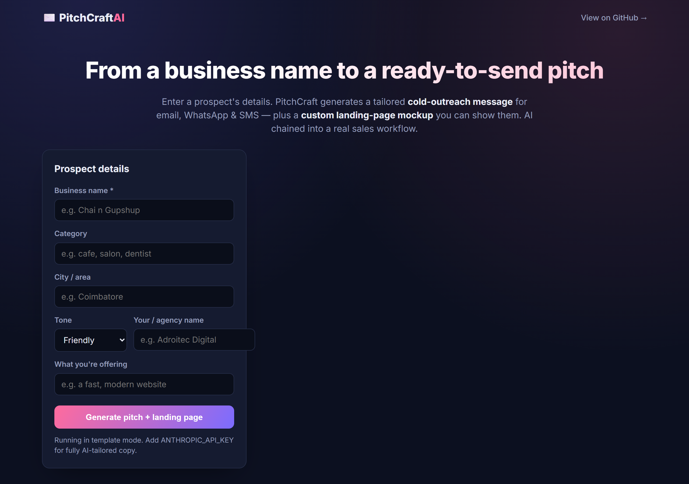
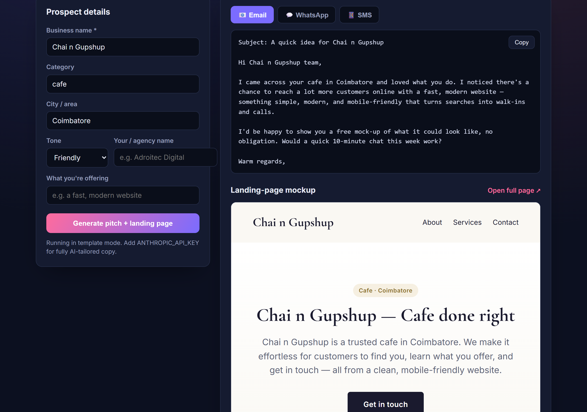

# ✉️ PitchCraftAI — AI Outreach Automation

> Enter a prospect's business → instantly get a **tailored cold-outreach pitch** (email + WhatsApp + SMS) **and** a **custom, ready-to-show landing-page mockup**. AI chained into a real sales workflow — not just a chatbot.

Pairs perfectly with a lead-gen tool: take a business you found, and in one click produce everything you need to pitch them.


---

## ✨ Why this project

It demonstrates the skill recruiters actually want from "AI builders" — **chaining an LLM into a structured workflow with reliable output**, not just chatting:

- **Multi-output generation** — three channel-specific outreach messages *plus* a full landing page from a single input.
- **Reliable rendering** — the LLM returns **structured JSON**, and the landing page is built from a **fixed, tested HTML template**. The markup is always valid, escaped, and on-brand regardless of what the model writes.
- **Always works** — full **deterministic template fallback** with no API key, with category-aware copy and services.
- **On-brand for a digital agency** — written exactly like the prospecting → demo workflow a web studio runs.

---

## 🖥️ Demo

`npm start` → <http://localhost:3004>. Enter e.g. **"Chai n Gupshup", cafe, Coimbatore**, choose a tone, and generate. You get:
- 📧 **Email** / 💬 **WhatsApp** / 📱 **SMS** outreach (with copy buttons), and
- a **live landing-page preview** in an iframe (open full page in a new tab).

### Screenshots

| Enter prospect details | Generated pitch + live landing page |
| :---: | :---: |
|  |  |

---

## 🧠 How it works

```
  business profile (name, category, city, tone, offer)
        │
        ▼
  generateContent()  ──►  Claude returns STRUCTURED JSON
        │                  { tagline, about, services[], outreach{email,whatsapp,sms} }
        │                  (validated; falls back to a deterministic template)
        ├──► outreach messages  → UI (email / whatsapp / sms tabs)
        └──► renderLandingPage() → fixed HTML template → /preview (iframe + new tab)
```

Generating **content** (not raw HTML) with the model and rendering through a **fixed template** is the key reliability decision — see [`src/generator.js`](src/generator.js).

---

## 🚀 Quick start

```bash
git clone https://github.com/<you>/ai-outreach-automation.git
cd ai-outreach-automation
npm install
cp .env.example .env       # optional: add ANTHROPIC_API_KEY for tailored copy
npm start                  # → http://localhost:3004
npm test                   # 8 unit tests (no network)
```

---

## 🔌 API

| Endpoint | Body / Params | Returns |
| --- | --- | --- |
| `POST /api/generate` | `{ businessName, category, city, tone, senderName, offer }` | `{ tagline, about, services[], outreach{email,whatsapp,sms}, previewUrl }` |
| `GET /preview` | — | The most recently generated landing page (HTML). |
| `POST /api/landing-page` | same profile | Landing-page HTML directly. |
| `GET /api/health` | — | `{ status, llm }`. |

Tones: `friendly`, `professional`, `bold`.

---

## 🏗️ Tech stack

- **Backend:** Node.js + Express
- **AI:** Anthropic Claude (structured JSON generation) with deterministic fallback
- **Rendering:** server-side HTML template (escaped, self-contained, Cormorant + Inter)
- **Frontend:** vanilla JS — channel tabs, copy-to-clipboard, live iframe preview
- **Tests:** `node:test` — profile normalisation, fallback content, HTML escaping, JSON extraction

## ⚖️ Use responsibly

Generated outreach is a starting draft — review before sending, personalise further, and follow anti-spam / consent rules for your region. Don't send unsolicited bulk messages.

## 📜 License

MIT — see [LICENSE](LICENSE).
